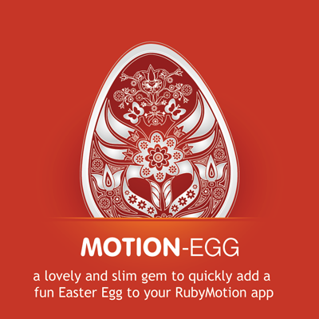
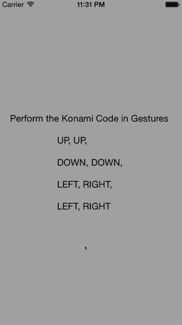

[](http://badge.fury.io/rb/motion-egg)  



###[Github Page](http://gantman.github.io/motion-egg/)
## Wat?

This gem allows you hide a small bit of fun in any of your serious apps.  
* Have a girl to impress?  
* Want to feature some of your good friends in apps that they have no business being in?
* Need to add your flair to a product?
 
**Have all the fun, without writing any of the code.**



## Usage

Once the gem is included, call `add_egg` on the `UIWindow` created in `app_delegate.rb`

```ruby
# This will add the an easter egg with all defaults
@window.add_egg

# This will add an easter egg with options
@window.add_egg(number_touches: 2, image_file: "taco.png")
```

The customizable options and defaults are:
* **secret_code:** An array of UISwipeGestureRecognizer constants.  
    * Default value `[
    UISwipeGestureRecognizerDirectionUp, UISwipeGestureRecognizerDirectionUp, 
    UISwipeGestureRecognizerDirectionDown, UISwipeGestureRecognizerDirectionDown, 
    UISwipeGestureRecognizerDirectionLeft, UISwipeGestureRecognizerDirectionRight,
    UISwipeGestureRecognizerDirectionLeft, UISwipeGestureRecognizerDirectionRight
  ]`
* **number_touches** Integer of how many touches are required when entering the code. 
    * Default value `1`
* **image_file** The string array of the image resource for the Easter egg.
    * Default value `toasty.png`


## Installation

> 1. `gem install motion-egg`

OR

> 2. Add `gem 'motion-egg'` to your `Gemfile` and then bundle

## Pull Requests

It would be really cool if you can think of ways to improve this gem, but keep it small and unintrusive!

## Roadmap/Features - PRs welcome

* Hoping to eventually add sound 
* Hoping to add alternate animations
* Hoping to make the egg more configurable
* Hoping to possibly show an interactive view, and not just an image
